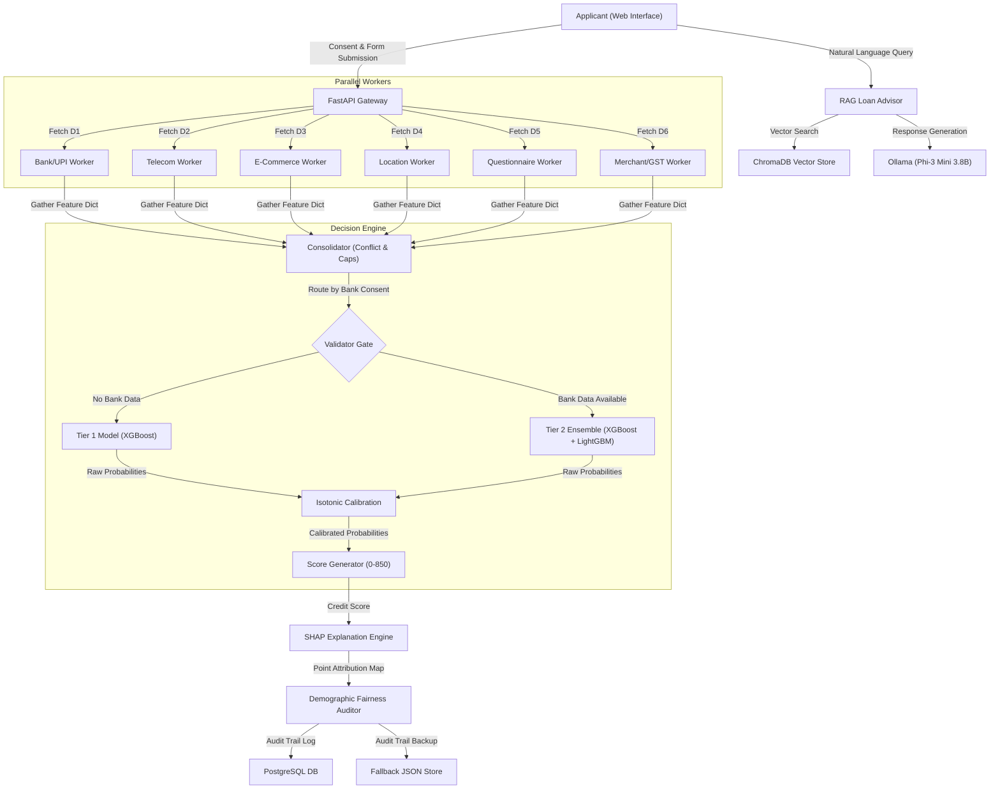

# AltGrade — Architecture Reference Spec

AltGrade is an AI-powered alternate credit scoring and inclusive banking system for credit-invisible individuals and MSMEs in India. It scores applicants on a 0–850 scale using six consented alternate data sources instead of traditional bureau credit histories.

---

## 1. System Topology



---

## 2. Core Architectural Components

### 2.1 Consent & Privacy Layer (DPDP Act 2023 Compliant)
- **Granular Consent**: Users select specific alternate data sources via checkable toggles.
- **Dynamic Routing**: The application dynamically determines the scoring Tier based on which inputs are approved (e.g., if Bank/UPI access is withheld, the user is automatically routed to Tier 1 instead of being blocked).
- **Data Minimization**: High-precision geolocation coordinate storage is prohibited; location stability signals are restricted to district-level indicators.

### 2.2 Parallel Data Workers (D1–D6)
Six parallel worker streams execute simultaneously to gather alternate financial and behavioral markers:

| Source | Key Parameters Checked | Risk Indicator |
| :--- | :--- | :--- |
| **D1: Bank/UPI Cash Flow** | Monthly inflows, balance trends, volatility, minimum balance ratio, UPI txn count | Cash volatility & liquidity buffers |
| **D2: Telecom & Utility** | 24-month payment consistency, recharge frequency, average plan value, missed payments | Routine payment discipline |
| **D3: E-Commerce** | Order count (6m), return rate, monthly spend, account age, EMI spend ratio | Cash flow distress & shopping profile stability |
| **D4: Geolocation** | Years at current address, address changes (24m), metro vs non-metro category | Residence and occupational stability |
| **D5: Questionnaire** | CFPB financial capability score, straight-line check, answer std deviation, hesitation | Behavioral risk orientation & questionnaire integrity |
| **D6: Merchant/GST** | GSTIN validity, filing regularity %, months operating, annual turnover | Small business longevity and fulfillment consistency |

### 2.3 The Consolidator Layer
The Consolidator layer acts as a data mediation and policy enforcement gatekeeper.

1. **Signal Conflict Detection**:
   - Compares individual worker SHAP point attributions.
   - If two workers have opposite net impact signs (one positive, one negative) and their combined absolute points difference exceeds a predefined threshold (`WORKER_CONFLICT_THRESHOLD = 50.0`), a conflict is flagged (e.g., stable Bank inflow but high-frequency distress E-commerce purchases).
   - Conflicting signals are flagged, logged, and returned to the frontend.

2. **Hard Policy Caps**:
   - **Wilful Defaulter Cap**: If the applicant is flagged on official default registries (simulated or AA checks), their maximum allowed credit score is capped at `200`, bypassing model scores.
   - **High EMI Burden Cap**: If current monthly obligations exceed safe income thresholds, the score is capped at `350`.

3. **Tier 1 Moderation/Reweight**:
   - Mitigates proxy discrimination (e.g., low location stability scores due to migratory labor).
   - If Location net points are negative (`< -10.0`) but the Psychometric Questionnaire shows high financial capability (`> 5.0`), the system moderates the location penalty by up to `30.0` points.

---

## 3. Machine Learning & Calibration Engine

### 3.1 Two-Tier Model Architecture
- **Tier 1 (Zero-History)**:
  - Intended for credit-invisible individuals.
  - Excludes banking/UPI data. Trains exclusively on D2 (Telecom), D4 (Location), and D5 (Psychometric).
  - Uses a single `XGBClassifier` wrapped in `CalibratedClassifierCV`.
- **Tier 2 (Ensemble)**:
  - Intended for individuals with basic digital footprint.
  - Combines all six workers (D1–D6).
  - Employs a blended ensemble of `XGBClassifier` and `LGBMClassifier` (`blended = (xgb_probs + lgbm_probs) / 2`).

### 3.2 Isotonic Calibration
Raw classifier probabilities are calibrated using `IsotonicRegression` to align predicted default risk with empirical historical defaults. A separate isotonic model is fit for each of the three risk classes:
1. Low Risk (calibrates to score band `700–850`)
2. Medium Risk (calibrates to score band `450–700`)
3. High Risk (calibrates to score band `0–450`)

### 3.3 Score Mapping Formula
The final score is determined deterministically from the calibrated class probabilities:
$$Score = BaseScore + \left(Confidence \times 0.7 + 0.15\right) \times (BandWidth)$$
Jitter is applied during training simulation to prevent discrete grouping.

---

## 4. Responsible AI, Explainability, & Fairness Auditing

### 4.1 Local SHAP Explanations
- The system computes local SHAP values using `shap.TreeExplainer` on the XGBoost component.
- The raw SHAP values are normalized and scaled to sum exactly to the difference between the applicant's score and the base median score (`600`).
- These values translate into positive or negative point contributions per worker (e.g., `+45 points` for on-time telecom bills, `-20 points` for high returns).

### 4.2 Three-Layer Fairness System
1. **Pre-processing**: Complete removal of demographic features (gender, religion, caste, region) from training arrays.
2. **In-processing**: Sample re-weighting during model training to equalize positive prediction rates across protected subgroups.
3. **Post-processing**: Continuous Disparate Impact Ratio (DIR) auditing on applicant scoring batches using the four-fifths rule:
$$\text{DIR} = \frac{P(\hat{Y}=1 \mid \text{Underrepresented Group})}{P(\hat{Y}=1 \mid \text{Majority Group})} \ge 0.80$$

---

## 5. RAG Advisor Architecture

Post-score queries are handled by a localized RAG system ensuring zero hallucinations:

```
[User Query] 
     ↓
[nomic-embed-text] 
     ↓
[ChromaDB Vector Match (RBI Guidelines, Policy Docs)]
     ↓
[Context Construction & Formatting]
     ↓
[Ollama: Phi-3 Mini 3.8B Inference]
     ↓
[Grounded Answer]
```

- **Documents Stored**: RBI Fair Practices Code, Account Aggregator circulars, and credit score improvement guidelines.
- **Constraints**: Prompt rules enforce that if a query cannot be answered using the retrieved document context, the LLM must respond with a default rejection rather than fabricating answers.

---

## 6. Database & Caching Topology

- **PostgreSQL**: Stores applicant metadata, consolidated scores, SHAP detail lists, conflict arrays, and consent IDs for audit trails.
- **Redis**: Caches calculated SHAP values, session states, and rate limits the score API endpoints.
- **Local JSON DB Fallback**: In the absence of an active PostgreSQL connection, the backend writes transactions to `demo_data/scores_db.json` to ensure complete standalone operation.
- **Statement Parsing Fallback**: Uses `pdfplumber` to parse bank statements locally when live Account Aggregator API sandboxes are offline.

---

## 7. Project Folder Layout

```
altgrade/
├── .agents/                    # Custom AI agent workflows and configurations
├── backend/
│   ├── app/
│   │   ├── data_gen/           # Synthetic Faker generators (D1-D6)
│   │   ├── ml/                 # ML pipeline, consolidator, and explainer logic
│   │   ├── models/             # Database and Pydantic schemas
│   │   ├── rag/                # Vector store ingestion and Ollama client
│   │   ├── routes/             # FastAPI score, consent, and advisor endpoints
│   │   ├── main.py             # App initialization
│   │   └── config.py           # Environment config parsing
│   └── tests/                  # Unit and integration test suites
├── frontend/
│   ├── src/
│   │   ├── components/         # Reusable shadcn/ui custom components
│   │   ├── pages/              # Dashboard, consent flow, and advisor interfaces
│   │   └── App.tsx             # Application routing
├── models/                     # Saved XGBoost and LightGBM model weights
├── demo_data/                  # Fallback databases and user profiles (JSON)
├── docs/                       # Technical specs, build guides, and references
└── ARCHITECTURE.md             # This architecture specification
```
