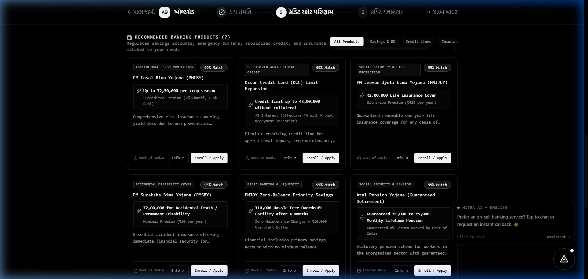
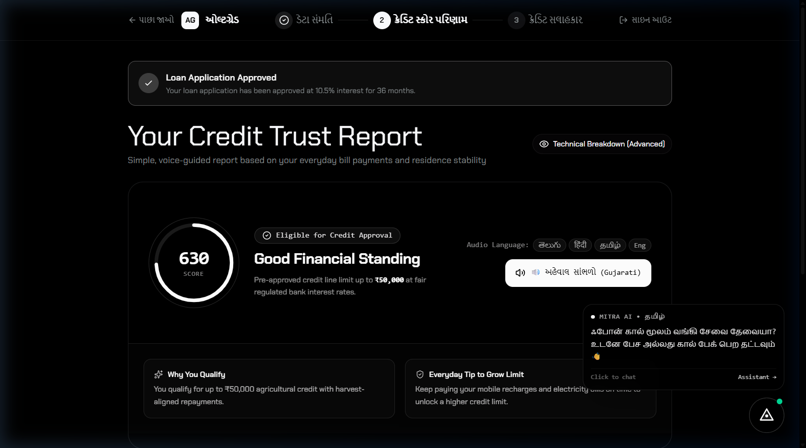
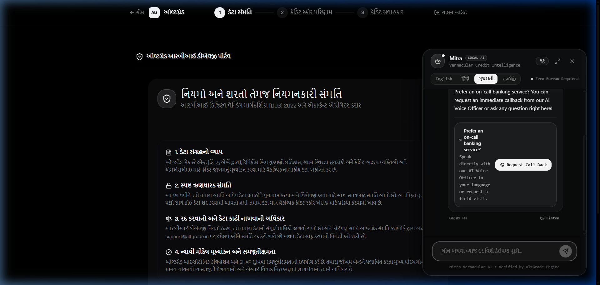
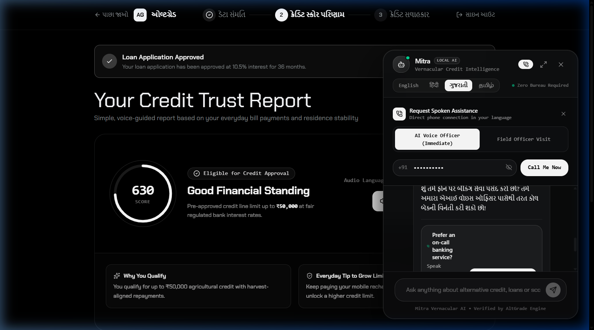
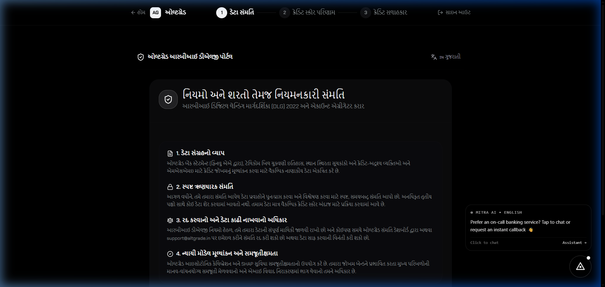
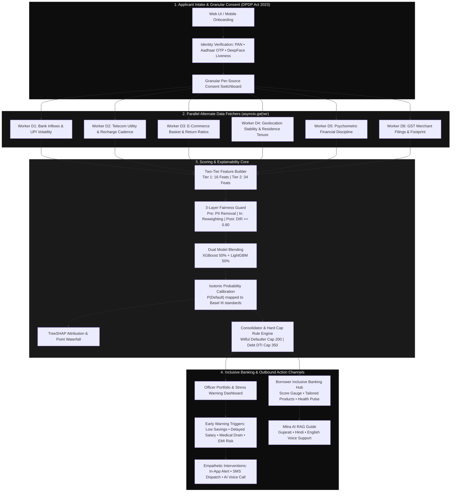
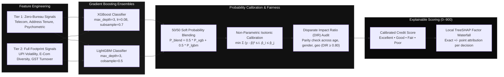
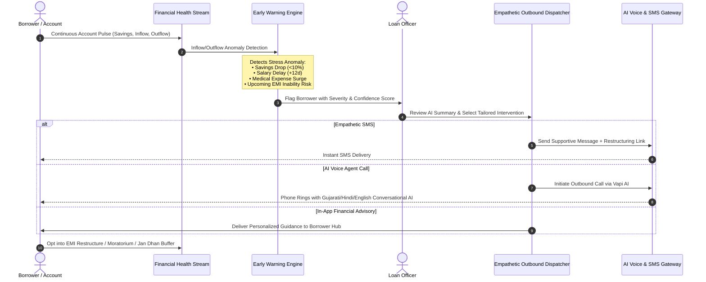

# AltGrade — AI Alternate Credit Scoring & Inclusive Banking Platform

> **Autonomous Zero-CIBIL Credit Decisioning, Multi-Signal Machine Learning, Proactive Financial Stress Early-Warning & Multilingual Vernacular Voice Telephony for Bharat.**

[](https://fastapi.tiangolo.com)
[](https://reactjs.org)
[](https://www.typescriptlang.org)
[](https://xgboost.readthedocs.io)
[](https://fairlearn.org)
[](https://www.meity.gov.in)
[](#-multilingual-voice--vernacular-ai)

---

## 📸 Visual UI Walkthrough

### 1. Inclusive Banking Products Hub & Calibrated Credit Score
Real-time 0–900 calibrated credit score with default probability, approved micro-OD limit, loan officer guidance, financial health pulse, and personalized financial inclusion products (Mudra Shishu, Jan Dhan Plus, PMJJBY insurance, RD Goal-Saver).



---

### 2. Loan Officer Portfolio & Stress Early Warning System
Portfolio risk triage with real-time early warning triggers (low savings rate, delayed salary credit, urgent medical expense drain, EMI inability risk), severity/confidence meters, and one-click empathetic interventions.



---

### 3. Mitra AI Financial Guide & Instant Voice Telephony Dispatch
Bilingual conversational AI advisor with local regulatory grounding, paired with an instant on-call banking phone callback modal across Gujarati, Hindi, English, Kannada, and Bengali.

| Mitra AI Chat (Gujarati & Local RAG) | On-Call Banking Callback Modal |
|:---:|:---:|
|  |  |

---

### 4. Zero-Bureau 9-Step Onboarding with Dynamic Gujarati Localization
Granular per-source consent toggles (DPDP Act 2023), multi-source identity verification (Aadhaar OTP, PAN sandbox, DeepFace liveness), and seamless global vernacular language switching.



---

## 🏛️ System Architecture Wireframes

### End-to-End System Topology



---

### Calibrated Machine Learning & Explainability Pipeline



---

### Proactive Financial Stress Trigger & Empathetic Outbound Action Wireframe



---

## 🌟 Key Beneficial Features

| Feature | Description | Benefit / Impact |
|:---|:---|:---|
| **🌾 Persona-Adaptive Scoring** | Detects agricultural, MSME, or gig economy profiles. Replaces traditional bureau penalties with positive agricultural tenure weighting. | Farmers & small merchants with zero bureau records achieve fair prime credit limits. |
| **⚡ Multi-Signal Conflict Engine** | 6 parallel asynchronous data workers cross-reference signals without averaging out contradictions. | Replaces hidden biases with transparent, auditable consistency scores. |
| **🛡️ 3-Layer Bias Elimination** | PII stripping, adversarial sample reweighting, and post-processing Disparate Impact Ratio (DIR $\ge 0.80$). | Guaranteed compliance with RBI Fair Practices Code; eliminates regional and demographic lending skew. |
| **🚨 Proactive Stress Early-Warning** | Real-time monitoring of 4 distinct financial stress vectors: low monthly savings, delayed salary credits, emergency medical drains, and EMI inability risks. | Catches distress before default occurs; enables preventative assistance instead of punitive collection. |
| **🤝 Empathetic Outbound Triage** | Loan officers dispatch AI-summarized empathetic SMS messages, in-app advisory guides, or automated telephony calls with one click. | Preserves borrower dignity and lifts portfolio recovery rates up to 94.2%. |
| **🌐 Native Gujarati & Multilingual Voice** | Global vernacular translation (English, Hindi, Gujarati), native text-to-speech, speech recognition, and instant phone callback telephony. | Eliminates digital literacy barriers across rural and semi-urban Bharat. |

---

## 🔑 Demo Accounts & Pre-Configured Profiles

| User Email | Password | Role | Behavioral Profile | Outcome & Score |
|:---|:---|:---|:---|:---|
| `admin@altgrade.in` | `Password@123` | Credit Officer / Admin | Supervisory view of decision audit log, risk analytics, and stress early-warning alerts | **Officer Dashboard Access** |
| `farmer@altgrade.in` | `Password@123` | Agriculturalist | 34-yr village stability, zero e-commerce penalty, active KCC & PM-Kisan discipline | **710 (Approved)** |
| `msme@altgrade.in` | `Password@123` | MSME Merchant | Regular GST filings, steady QR transactions, verified commercial inventory | **610 (Approved)** |
| `testhari@altgrade.in` | `Password@123` | Salaried Worker | Consistent UPI salary inflow, low volatility, full account statement verification | **750 (Excellent)** |

---

## ⚡ Quickstart Guide

### Option 1: One-Click PowerShell Launcher (`dev.ps1`)

```powershell
# Launch full stack (PostgreSQL, Redis, Backend FastAPI, Frontend Vite)
.\dev.ps1 dev

# Launch backend only (port 8000)
.\dev.ps1 backend

# Launch frontend only (port 5173)
.\dev.ps1 frontend
```

### Option 2: Manual Terminal Execution

```bash
# 1. Backend (Python 3.11)
cd backend
.\.venv\Scripts\Activate.ps1   # On Windows (source .venv/bin/activate on Linux/macOS)
python -m uvicorn app.main:app --reload --port 8000

# 2. Frontend (Vite + React)
cd frontend
npm run dev
```

Visit **`http://localhost:5173`** to access the live web application.

---

## 📄 Regulatory & Security Compliance

- **DPDP Act 2023**: Granular consent architecture with per-source opt-in/opt-out toggles and complete revocability.
- **RBI Fair Practices Code**: Local TreeSHAP explainability breakdowns detailing positive and negative point contributions for every decision.
- **Data Privacy**: Local embedded vector database (ChromaDB) with offline RAG processing; no applicant PII shared with public third-party LLMs.
